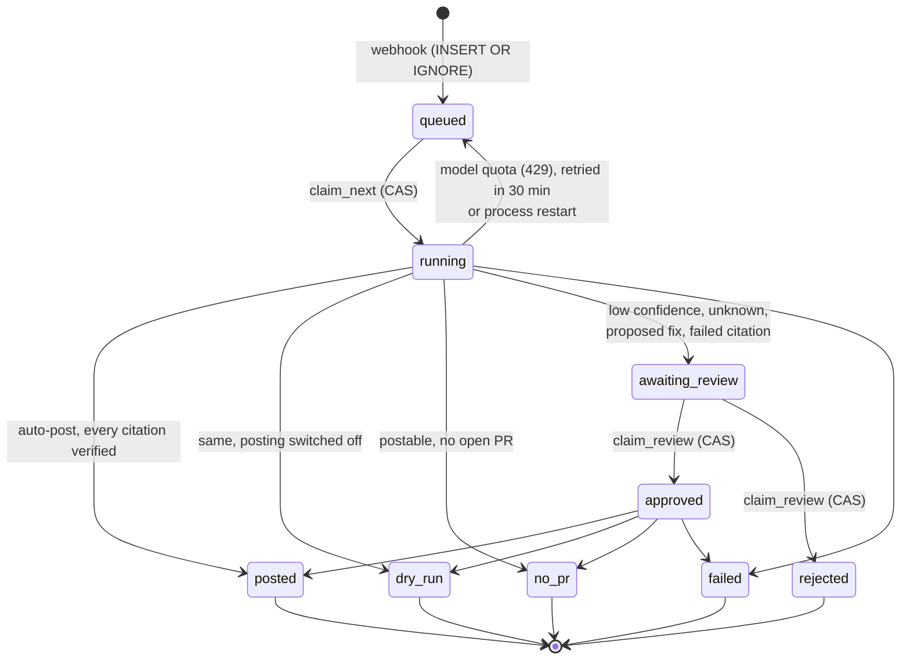

# CI triage agent

An agent that reads a failed GitHub Actions run and decides *why* it is red —
`flaky`, `regression`, `infra`, `dependency` or `unknown` — citing the log lines
that prove it. Low-confidence verdicts route to a human instead of being posted.

**Status: in progress.** Capture, the agent, its evidence checking and the eval
harness work end to end against 43 captured runs, and a webhook service runs the
same agent on live runs, with a review gate for the verdicts it will not post on
its own. The agent can reproduce a failure in a sandbox when asked to, and a
dashboard streams a triage as it happens.

**What is not measured yet.** Category accuracy has no score so far. Three of the 43
fixtures carry a human label (two `regression`, one `infra`), and no sweep has
reached them before the daily quota ran out. No fixture is labelled `flaky`, and
at most two in the corpus could be ([why](#what-this-corpus-can-and-cannot-teach)),
so that class will not get an accuracy number worth reading from this corpus.
Every figure below is citation verification. It needs no labels and covers every
fixture a model has answered.

## The idea it is built around

A model can write a fluent, confident, wrong verdict. It cannot fake a quote at
coordinates that do not contain it.

So every citation carries a log path, a line range and the quoted text, and
every one is looked up in the source log after the run. That turns "is this
reasoning any good?" into a mechanical question, and it gives a second quality
axis — the share of citations that survive verification — next to category
accuracy.

It catches real failures. Running `sweep__30005314760` on `gpt-oss-20b`:

```
category:   regression  (confidence 0.95)   <- agrees with the human label
evidence:
  [BAD ] 3_build (macos-latest...).txt:978-990
          quote does not appear within the cited lines
```

The right answer, resting on a citation the model invented.

## How it works

```
ci-triage hunt <owner/repo>   find failed runs worth capturing
ci-triage fetch <run-url>     capture run, jobs, logs, diff and history
ci-triage inspect <fixture>   show exactly what the agent will be shown
ci-triage triage <fixture>    run the agent, print and check its verdict
ci-triage label <fixture>     record human ground truth for the eval set
ci-triage eval                score the agent over the whole corpus
ci-triage serve               triage live runs as GitHub reports them
ci-triage review              approve or reject what the service would not post
ci-triage reproduce <fixture> rerun the failure in a sandbox, and try a patch on it
```

A captured run is the unit of work. The agent's three tools — `get_logs`,
`get_diff`, `test_history` — read that capture and nothing else, so a triage run
is offline, costs no GitHub API calls, and produces the same prompt next month
as today. An eval score that moves means the agent moved.

Some decisions worth naming:

- **Routing is code, not a model field.** The model reports a category and a
  confidence; `route()` decides whether that may be auto-posted. The threshold
  can be swept in an eval without touching the prompt.
- **One definition of each category.** `CATEGORY_GUIDE` is handed to the model
  as part of the output schema *and* is the guide a human follows when
  labelling. If those two drifted, eval scores would stop meaning anything.
- **Matrix failures are collapsed.** One run here has 37 failed jobs saying the
  same thing 37 ways. They are fingerprinted on masked failure lines and shown
  as one representative — and the count is reported, because "37 jobs failing
  identically" is evidence of one cause rather than of a broken environment.
- **Verdicts are cached, routing is not.** Only the model's answer is stored,
  keyed on a hash of everything the model was shown — the prompt, and the
  reduced logs, diff and history under it. Editing the anchors or the failure
  fingerprint invalidates the cache as surely as editing the prompt does, so a
  score can never come from answers to a question no longer being asked.
  Tightening the evidence check or raising the confidence threshold re-scores
  every run already paid for, for free.

## Scoring it

```bash
uv run ci-triage eval                # every captured run
uv run ci-triage eval --labelled     # only the ones carrying ground truth
uv run ci-triage eval --cached-only  # re-score what is already answered, free
```

Two metrics, and only one of them needs a human:

| metric | needs labels? | covers |
| --- | --- | --- |
| citation verification rate | no | all 43 fixtures |
| category accuracy | yes | the labelled subset |

That asymmetry is why the harness was not gated on labelling. Whether a quoted
line is really at the coordinates the model gave is a question `verify_evidence`
answers against the log, with no human in it anywhere — so the citation number
covered the whole corpus from the first sweep, while accuracy waited on hand
labelling and grows as it arrives.

It is also the more particular of the two. Category accuracy is table stakes for
anything that classifies. A number for how often a model invents the evidence
under a verdict, produced by a harness that proves it line by line, is not.

Reported beside them, and needing no labels either, is the number that is a
liability rather than a metric: **auto-posted verdicts carrying a citation that
fails verification**. Those are the comments that would have landed on someone's
pull request quoting a line that is not in the log.

Sweeps are resumable and re-scoring is free. Only the model's answer is cached,
keyed on a hash of the prompt, so a sweep stopped by a daily quota — the normal
way a free-tier sweep ends — resumes for the price of what it never reached, and
tightening the evidence check or moving the confidence threshold re-scores every
verdict already paid for without spending anything. The threshold sweep in the
report is re-derived from stored verdicts for exactly that reason.

### Where the numbers stand

Four free-tier sweeps so far, each stopped by Groq's daily token cap and
resumed from the verdict cache. Citation verification needs no labels, so it
already covers every fixture that has been answered:

| model | fixtures answered | citations verified | verdicts with every citation sound | auto-posts resting on an invented quote |
| --- | --- | --- | --- | --- |
| `gpt-oss-120b` | 28 | 44 / 48 (92%) | 25 / 28 | 0 |
| `gpt-oss-20b`  | 20 | 15 / 29 (52%) | 9 / 20  | 2 |

There is no accuracy column because none of these answered fixtures carries a
label. None of the three labelled fixtures has a cached verdict from either
model (`pydantic__35411255497`, for one, hit the daily 429 on the 120b sweep).

The smaller model invents evidence for close to half of what it cites, and two
of its confident verdicts would have gone onto a pull request quoting lines that
are not in the log. The service holds that at zero by refusing them.

The larger model auto-posted one verdict of 28, and not for lack of confidence:
it attaches a `suggested_fix` to nearly every verdict, and a proposed code
change always routes to a human. That is the policy working as written, but it
means almost all of its verdicts land in the review queue, which is why the
queue now has a way out.

Six 20b fixtures fail with a 413: its free tier allows 8k tokens a minute, and
a multi-turn triage of a large log outgrows that before it outgrows the daily
cap.

### What this corpus can and cannot teach

`flaky` is defined here as one commit producing both outcomes, which puts a hard
floor under how many flaky fixtures can exist: a run only qualifies if its
history records a pass *and* a fail on the same SHA. Across the 43 captured
runs, two do — `pandas__35496694897` and `pandas__35499323117`. Six more have a
second run on that commit and none of them passed: four were `action_required`,
one was `cancelled`, one failed again.

So the flaky class stays small however long the labelling runs. Its accuracy
would be read off two fixtures at most, which is an anecdote, not a rate. That is a fact about how CI reruns get
recorded, not about the labelling, and the honest response is to report the
per-class counts beside the accuracy rather than to hunt for flakes until the
class looks balanced.

## Running it

Requires Python 3.12+ and [uv](https://docs.astral.sh/uv/).

```bash
uv sync
echo 'GITHUB_TOKEN=...' >> .env.local
echo 'GROQ_API_KEY=...'  >> .env.local

uv run ci-triage fetch https://github.com/owner/repo/actions/runs/123456
uv run ci-triage triage repo__123456
```

The default model is `groq:openai/gpt-oss-120b`, on Groq's free tier. Pass
`--model` for any provider pydantic-ai supports — `anthropic:claude-opus-5`,
`google-gla:gemini-2.0-flash`, `ollama:qwen2.5:14b`. Running below the frontier
is deliberate: a weaker model is what makes the citation check measure anything.

Captured runs land in `fixtures/`. The logs are gitignored — roughly 370 MB
across 43 runs, all re-fetchable from their run URLs. Each fixture's `meta.json`
is not: a run URL regenerates its logs, and nothing regenerates a human reading
them and deciding what broke.

## Running it on live runs

`ci-triage serve` is a small FastAPI service for a GitHub App's webhook. It
takes failed `workflow_run` deliveries, captures each run to disk exactly as
`fetch` would, triages the capture, and decides what to do with the verdict:

| outcome | when |
| --- | --- |
| `posted` | auto-post route **and** every citation verified; comment on the PR |
| `dry_run` | the same, while posting is switched off (the default) |
| `awaiting_review` | low confidence, `unknown`, a proposed fix, or any citation that failed |
| `no_pr` | postable, but the commit has no open pull request |
| `rejected` | a reviewer closed it without posting |

The rule that matters is the second half of the first row. The eval reports
auto-posts carrying a failed citation as a liability; the service does not
count them, it refuses them. A comment is posted only when every quote in it
was found where it claims to be, and it edits its own earlier comment on a
re-run rather than stacking another.

The handler only checks the signature and queues the run in SQLite, keyed on
`(repo, run, attempt)`, so a redelivered webhook changes nothing. A run
interrupted by a restart is picked up again on the next start. A run that hits
the model's quota waits and retries instead of failing. Every verdict, posted
or not, is at `GET /runs` along with the comment it would have posted.

A verdict in `awaiting_review` is moved on by a person:

```bash
uv run ci-triage review                                   # the queue
uv run ci-triage review 12                                # one verdict, and the comment it would post
uv run ci-triage review 12 --approve --as octocat         # post it, naming you in the footer
uv run ci-triage review 12 --reject --as octocat --note "wrong job"
```

Behind those are `POST /runs/{id}/approve` and `/reject`, which need
`CI_TRIAGE_REVIEW_TOKEN` as a bearer token and are switched off until it is set.
A reviewer stands in for the routing policy and nothing else. Approval can post
a low-confidence verdict or a proposed fix, which then appears in the comment,
but it cannot post a verdict whose citations failed verification: a person can
vouch for a judgement, not for a quote the log does not contain. Those can only
be rejected. Approval still respects the dry-run switch and still needs an open
pull request, and a run is decided once, so two reviewers acting at the same
moment cannot both post it — what makes that true, and the test that races it,
are under [the data model](#the-data-model).

```bash
echo 'GITHUB_WEBHOOK_SECRET=...' >> .env.local     # required; unsigned requests get 401
echo 'GITHUB_APP_ID=...' >> .env.local             # or rely on GITHUB_TOKEN
echo 'GITHUB_APP_PRIVATE_KEY_FILE=app.pem' >> .env.local
echo 'CI_TRIAGE_REVIEW_TOKEN=...' >> .env.local    # enables approve / reject
uv run ci-triage serve                             # dry run; add CI_TRIAGE_POST_COMMENTS=1 to post
```

The App needs **Actions: read**, **Contents: read** and **Pull requests:
write**, and a subscription to the **Workflow run** event. The service binds to
localhost; expose it with a tunnel (`cloudflared`, `ngrok`) rather than a
public interface, since `/runs` has no authentication.

## The data model

The service keeps one table. Every webhook it accepts becomes one row, and that
row carries the run through triage, review and posting:

```sql
CREATE TABLE runs (
    id            INTEGER PRIMARY KEY,
    -- what the run is: the idempotency key, straight from GitHub
    repo          TEXT    NOT NULL,      -- owner/name
    run_id        INTEGER NOT NULL,
    run_attempt   INTEGER NOT NULL,
    installation  INTEGER,               -- which App installation token to use
    delivery      TEXT,                  -- X-GitHub-Delivery, kept for tracing only
    html_url      TEXT    NOT NULL,
    -- where it is in the queue
    status        TEXT    NOT NULL,      -- see the state machine below
    attempts      INTEGER NOT NULL DEFAULT 0,
    not_before    TEXT,                  -- set when a model quota defers it
    received_at   TEXT    NOT NULL,
    updated_at    TEXT    NOT NULL,
    -- what the agent concluded
    fixture       TEXT,                  -- path of the capture it was shown
    verdict       TEXT,                  -- the Verdict, as JSON
    route         TEXT,                  -- auto_post | human_review
    reason        TEXT,
    evidence_ok   INTEGER,               -- did every citation verify?
    comment       TEXT,                  -- the comment it posted, or would have
    comment_url   TEXT,
    error         TEXT,
    -- who decided it, when a person did
    reviewed_by   TEXT,
    reviewed_at   TEXT,
    review_note   TEXT,
    UNIQUE (repo, run_id, run_attempt)
);
CREATE INDEX runs_status ON runs (status, received_at);
```

The table is denormalised on purpose. A verdict belongs to exactly one run
attempt, is written once, is read whole and is never queried by its fields. A
separate `verdicts` table would add a join and a foreign key and serve no query
the service makes. The verdict *cache* is the one thing kept outside the
database. It is keyed on the model's inputs rather than on a run, and the CLI,
the eval and the dashboard all share it without any of them having a database.

**Indexes, and the queries they exist for**

| index | serves | why this shape |
| --- | --- | --- |
| `UNIQUE (repo, run_id, run_attempt)` | intake, `INSERT OR IGNORE` | The idempotency key. It names the fact a delivery reports, not the delivery itself, so one run attempt is one row however many envelopes it arrives in. `run_attempt` is part of it because a re-run is a new question with new logs. |
| `runs_status (status, received_at)` | the worker's next run; the review queue | Equality on `status` first, then ordering on `received_at`. Both queries read rows off the index already sorted, with no sort step (`EXPLAIN QUERY PLAN`: `SEARCH runs USING INDEX runs_status (status=?)`). `not_before` is left out because it only filters among queued rows, which are few. |
| `id` (rowid) | `GET /runs/{id}`, every update | Free in SQLite. |

Nothing else is indexed. The unfiltered `GET /runs` scans the table and sorts
it, which costs nothing at this size. An index on `received_at` alone is the
fix once it does.

**What "a run is decided once" rests on**

Two mechanisms make two different guarantees, and neither is a lock held in
Python:

- **Intake is idempotent by constraint.** `enqueue` is an
  `INSERT OR IGNORE` against the unique key. A redelivered webhook gets back
  "already known", so it can't queue a second triage or post a second comment.
- **Every claim is a compare-and-set.** `claim_next` and `claim_review` are
  each a single conditional `UPDATE … WHERE id = ? AND status = ? RETURNING *`.
  The `WHERE` holds the expected state, and a returned row means the caller won.
  This is atomic because SQLite runs every statement in a transaction and allows
  one writer at a time: a write statement takes the database's `RESERVED` lock
  before it reads anything. So a second reviewer's `UPDATE` waits for the first
  to commit, then finds the status already moved and matches nothing. That is
  optimistic concurrency control. Nobody holds a lock while deciding, and the
  loser learns at the moment of the write.

The test makes this hold across connections, not only threads.
`test_two_reviewers_approving_at_the_same_moment_post_once` gives each reviewer
their own `Store`, and so their own connection and their own Python lock. Both
start from the same stale read of the run, so both pass `approve`'s own status
check. Exactly one comment is posted, and the other reviewer gets a 409 saying
someone else got there first. Two sibling tests do the same with eight
simultaneous reviewers on each of 25 runs, and with eight workers draining a
50-run queue: no run is claimed twice and none is missed. Each test was checked
against the bug it targets. With the `status` guard dropped from
`claim_review`, two comments are posted. With `claim_next` split into a read
followed by a write, 50 runs were claimed 197 times.

### A run's lifecycle



There are two CAS transitions, and they are the only places two actors can
compete. Each one enters a state with a single owner: a row in `running`
belongs to the worker that claimed it, and a row in `approved` to the reviewer
who did. So the transitions out of those states (`finish`, `settle`) can be
plain updates by `id`. A re-run on GitHub is not a transition at all. It
arrives as a new `run_attempt`, and so as a new row.

### The patterns, by name

- **Idempotent receiver.** GitHub delivers at least once, so the receiver makes
  a duplicate harmless rather than trying to prevent one. The idempotency key is
  the natural key `(repo, run_id, run_attempt)`, not the delivery GUID, so two
  different envelopes about the same run attempt also collapse into one row.
- **Queue-based load levelling.** GitHub gives up on a delivery after ten
  seconds, and a triage takes minutes. The handler checks the signature, writes
  the row and returns. The worker drains the queue at whatever rate the model
  quota allows.
- **Optimistic concurrency (compare-and-set).** Every state change that two
  actors could race is a conditional update, as described above.
- **Idempotent side effect.** The GitHub comment carries a hidden marker keyed
  on the run. Posting means "find the comment with this marker and edit it, or
  create it". So retrying a post, or re-running the job, edits the one comment
  rather than stacking another.
- **Content-addressed cache.** A verdict is stored under a hash of everything
  the model was shown. Nothing needs invalidating: change an input and the key
  changes with it.

## The dashboard

`dashboard/` is a Next.js app on the Vercel AI SDK. Its setup is in
[dashboard/README.md](dashboard/README.md).

- **Watch a triage.** A run's page streams the agent as it works: its
  reasoning, each tool call as it is made and filled in when it returns, and
  a verdict card that marks every citation *verified* or *not in log*. It is
  the same agent the eval scores, streamed in the AI SDK's UI message protocol
  by pydantic-ai's own adapter, and its answer lands in the same verdict
  cache.
- **Ask about the incident.** Next to it is a second agent, in TypeScript,
  for questions like "would this fail again?". Its tools are typed with Zod on
  the TypeScript side and served by the Python agent's own Pydantic-typed tools
  on the other, so the two agents read exactly the same evidence.
- **Decide the queue.** The review queue lists what the service would not
  post. A run's page re-checks each citation against the capture, so a
  reviewer sees *which* quote failed, and it will not offer to approve one that
  did.

The review token stays on the Next.js server; the browser only talks to the
app.

## Reproducing a failure

A verdict says why a run is red; a reproduction checks it. `ci-triage
reproduce` fetches exactly the run's commit into a throwaway container, runs a
command there, and with `--patch` runs it again with the patch applied:

```bash
uv run ci-triage reproduce pandas__35496694897 \
    -c "pip install -e . && pytest pandas/tests/io/test_x.py" --patch fix.diff
# reproduced, and the patch fixes it
```

Without `-c` it replays the script of the step that failed, read out of the
job's log. That is only a starting point, since the container has the
repository and none of the job's setup steps, and a failing `uses:` step has no
script to replay.

The same thing is a fourth tool for the agent, `reproduce`, behind
`triage --sandbox docker` or `CI_TRIAGE_SANDBOX=docker` for the service. It is
off by default and never used by the eval. A reproduction reaches the network
and a live repository, and the eval's premise is a triage that is offline and
asks the same question next month. Sandboxed verdicts are cached under their own
key, so they never mix with offline ones. A reproduction also cannot be cited:
evidence still has to be a quote from the captured log, so the citation check
means what it did.

The container runs as a non-root user with every capability dropped, no
privilege escalation, a read-only root filesystem, and caps on memory, CPU and
process count. It has network, because fetching the commit and installing
dependencies need it. The inputs reach the script as environment variables and
the patch on stdin, never spliced into its text. `--backend local` runs the same
script unisolated, for testing it without Docker; do not point it at code you
did not write.

## What changes at scale

Today this is one process, with one worker and one SQLite file. That is
deliberate, and it is also the first thing to change. What follows is what
breaks first and what replaces it.

### The bottlenecks, in order

**1. Model token quota, by three orders of magnitude.** One triage costs about
19k tokens over several requests, and Groq's free tier allows a model roughly
ten of those a day. GitHub allows a token or App installation 5,000 API
requests an hour, and capturing and commenting on a run takes about ten. That
is around 500 runs an hour against about ten a day. Adding workers, instances
or hardware does nothing for a service bounded like this. The quota is per
account, so every worker draws from the same bucket. N workers without
coordination just produce N times the 429s.

The 413s from `gpt-oss-20b` are the worked example, because they are a
different failure from a 429 and need different handling:

| | 429 | 413 |
| --- | --- | --- |
| means | the bucket is empty right now | this one request is bigger than the bucket ever holds (8k tokens a minute on the 20b free tier) |
| waiting fixes it | yes | never |
| what the service does | defer the run 30 minutes, up to 6 attempts (`store.defer`) | start the conversation again from scratch, once (`RUN_ATTEMPTS`) |
| why that response | the quota resets | request size depends on how long the agent's loop runs: `core__35505915015` answered in 4.1k tokens once and was refused at 9.0k another time |

The lesson for scaling is that a quota has two dimensions: total tokens over a
window, and the size of a single request. More capacity buys the first. Only a
smaller context buys the second, through tighter log excerpts or capping how
much of the conversation is resent each turn. At volume, the fix for both is a
shared token-bucket limiter in front of the provider, which workers ask before
calling. Otherwise each worker discovers the limit by hitting it.

**2. GitHub API rate limits.** These are second, and per installation, so they
shard naturally across the organisations that install the App. Capture is the
only API-heavy step. One gap: a 403 rate-limit response currently fails the run
rather than deferring it. The response carries `x-ratelimit-reset`, so it
should defer to that time, as a model 429 already does.

**3. SQLite's single writer.** This is last, and not soon: a triage makes a
handful of writes over several minutes. The single-writer lock is what
currently makes the compare-and-sets atomic. It becomes a bottleneck only long
after the model quota has, and it is a hard limit only once a second host needs
the file.

### The sketch

```
GitHub ──webhook──▶ load balancer ──▶ api × N     verify signature, INSERT … ON CONFLICT DO NOTHING
                                          │
                                      Postgres     runs table, same schema
                                          │
                                     worker × M     claim: … FOR UPDATE SKIP LOCKED
                                      │   │   │
              captures (immutable) ◀──┘   │   └──▶ verdict cache (content-addressed)
                                          ▼
                             shared token bucket ──▶ model provider
                                          │
                                          ▼
                         GitHub comment, upsert by marker, one poster per run
```

- **The API tier is already stateless.** Deduplication lives in the database,
  so any instance can take any delivery, including a redelivery of one another
  instance handled. N instances behind a load balancer need no sticky sessions.
- **SQLite becomes Postgres, and the schema moves as it is.** `claim_review`
  ports unchanged. Its expected status sits in the outer `WHERE`, and Postgres
  re-checks that clause against a row it had to wait for. `claim_next` now has
  the same outer guard (added with the concurrency tests). It would also want
  `FOR UPDATE SKIP LOCKED` in its subquery, so that workers skip rows another
  worker holds instead of queueing behind them. `INSERT OR IGNORE` becomes
  `ON CONFLICT DO NOTHING`.
- **Workers need a lease, not a restart sweep.** `requeue_interrupted` treats
  every `running` row at startup as abandoned. That is right for one process
  and wrong for many, where it would steal work a live worker is in the middle
  of. A `claimed_at` column with an expiry, renewed while the worker is alive,
  is the replacement.
- **Captures must be keyed on the attempt and never overwritten.** Today they
  land in `fixtures/<repo>__<run_id>/`. With one worker that is harmless. With
  several, two attempts of one run could overwrite a capture another worker is
  still triaging. Keyed on `(repo, run_id, run_attempt)` in object storage, a
  capture becomes immutable, which the citation check depends on (see below).
- **The verdict cache is what makes the triage step safe to parallelise.** The
  key is a SHA-256 of every input the model sees. So two workers holding the
  same key are answering the same question, and two workers holding different
  keys cannot touch each other's entries. Writes are a rename into place (also
  added with the concurrency tests), so a reader never sees half a file. If two
  workers race to fill one key, the last rename wins with an equivalent answer.
  The worst case is paying for the same answer twice, never getting a wrong
  one. Moving the cache from a local directory to an object store changes
  nothing about this.
- **Posting needs one poster per run.** `upsert_comment` finds the comment and
  then writes it, and nothing on GitHub's side makes that pair atomic. If two
  attempts of the same run were triaged at once, both could find no comment and
  both post one. One worker makes that impossible today. At scale, posting
  should take a per-run lock (`pg_advisory_xact_lock` on a hash of
  `(repo, run_id)`), or the queue should route all attempts of a run to the same
  worker.

### Consistency: what can lag and what cannot

The service has three kinds of state, and they need different guarantees. The
**verdict cache** can be as eventually consistent as anyone likes. A replica
that lags, an entry not yet written, a file another worker is mid-way through
writing: each is a miss, and a miss costs one model call, never a wrong answer.
The key covers every input, so an entry can be absent but never stale. The
**citation check** cannot lag at all. It decides whether a comment may be
posted, so it runs synchronously, on every triage including a cache hit, in the
same process, against the same capture bytes the model was shown. Its result is
never cached. It is only as strong as the capture is immutable, which is why
captures have to be keyed on the attempt before workers multiply. **Run status**
needs per-row linearisability: a transition either happened or it didn't, and
only one actor makes it happen. That is the compare-and-set, and it is the one
place the service relies on the database for correctness rather than for
storage. The outward effect, the comment on GitHub, is at-least-once by nature.
The marker makes it effectively once.

## Built with

Python 3.12 · [Pydantic AI](https://ai.pydantic.dev) for the agent loop and tool
definitions · FastAPI and SQLite for the webhook service · Pydantic v2 at every
boundary · [Logfire](https://logfire.dev) for tracing · httpx · Typer · pytest ·
uv.

## Not done yet

- Labelling the rest of the corpus. This is the slow part and only a human can
  do it, which is why the harness reports what it can without one.
- A run left in `approved` stays there. If the process dies between a reviewer
  approving a run and the comment being recorded, the row has no way out:
  `claim_review` only moves runs out of `awaiting_review`, and the restart sweep
  only requeues `running` rows. Posting is idempotent, so the fix is for startup
  to re-post `approved` rows as it requeues `running` ones.
- A GitHub rate limit fails a run instead of deferring it to
  `x-ratelimit-reset`.
